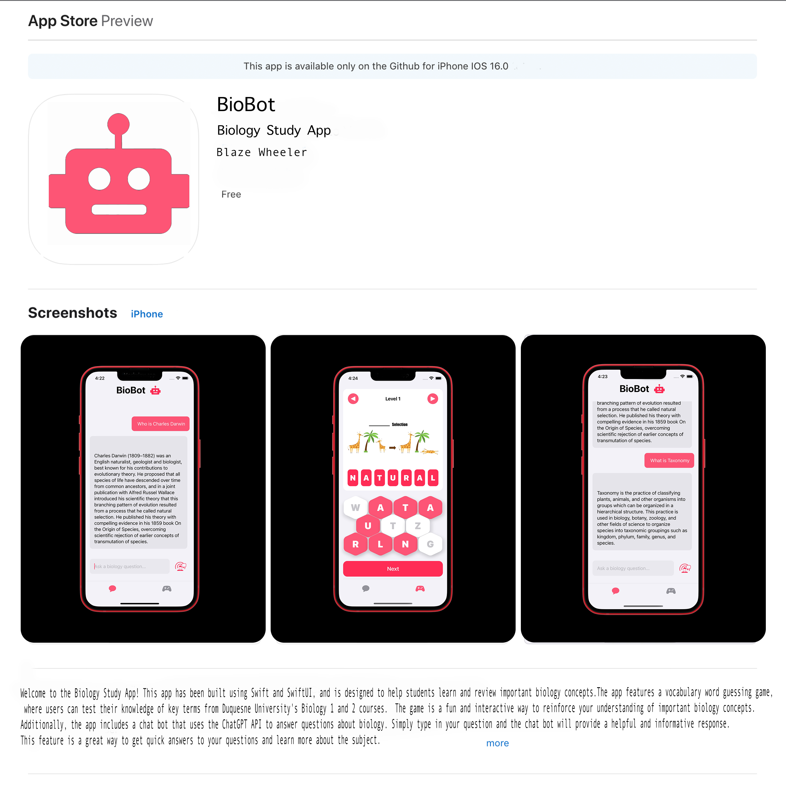

<!-- Improved compatibility of back to top link: See: https://github.com/othneildrew/Best-README-Template/pull/73 -->
<a name="readme-top"></a>


<!-- PROJECT SHIELDS -->
<!--
*** I'm using markdown "reference style" links for readability.
*** Reference links are enclosed in brackets [ ] instead of parentheses ( ).
*** See the bottom of this document for the declaration of the reference variables
*** for contributors-url, forks-url, etc. This is an optional, concise syntax you may use.
*** https://www.markdownguide.org/basic-syntax/#reference-style-links
-->
[![Apple-Silicon-Shield]][Apple-Silicon-Shield-url]
[![MIT License][license-shield]][license-url]
[![Apple License][Apple-License]][Apple-License-url]

[![LinkedIn][linkedin-shield]][linkedin-url]
[![GitHub][GitHub-shield]][GitHub-url]


<!-- PROJECT LOGO -->
<br />
<div align="center">
  <a href="https://github.com/BlazeWheeler/Swift_Projects/">
    
  </a>

  <h3 align="center">BioBot</h3>

  <p align="center">
   A Great Biology Study Resource
    <br />
    </div>


<!-- ABOUT THE PROJECT -->
## About The Project


Welcome to BioBot!

BioBot is a biology study app built using Swift and SwiftUI. This app is designed to help students learn and review important concepts from Duquesne University's Biology 1 and 2 courses.

One of the features of BioBot is a vocabulary word guessing game, which allows students to test their knowledge of key terms and definitions. In addition to this, BioBot also includes a chat bot that uses the ChatGPT API to answer questions about biology. This chat bot is a great resource for students looking to get quick and accurate answers to their questions, or for those who simply want to learn more about the subject.

Whether you're a student looking to ace your biology exams, or just someone interested in learning more about the subject, BioBot is the perfect tool for you. So give it a try and see how much you can learn!





<p align="right">(<a href="#readme-top">back to top</a>)</p>


### Built With

This Application is built natively with Swift & SwiftUI

* [![MacOs][MacOs]][MacOS-url]
* [![Swift][Swift]][Swift-url]
* [![OpenAi][OpenAI]][OpenAI-url]

<p align="right">(<a href="#readme-top">back to top</a>)</p>


<!-- GETTING STARTED -->
## Getting Started / Installation

Getting started is fairly simple...

### Prerequisites


* Install Xcode
* Sign Up: OpenAI Developer account
* Generate API Key:
* Download repository 
* Open 
  ```sh
  BioBot.swift

  ```
* Enter auth token
 ```sh
  func setup() {
		// Enter Token Here
        client = OpenAISwift(authToken: "")
    }

  ```

* Build, Run, & Have Fun!


<!-- ROADMAP -->
## Roadmap

- [x] Create UI
- [x] Add OpenAI Support
- [ ] Train Model
- [ ] Add Quiz View 

 


<!-- LICENSE -->


# Released Under MIT License

Copyright (c) 2022 Blaze Wheeler,

Permission is hereby granted, free of charge, to any person
obtaining a copy of this software and associated documentation
files (the "Software"), to deal in the Software without
restriction, including without limitation the rights to use,
copy, modify, merge, publish, distribute, sublicense, and/or sell
copies of the Software, and to permit persons to whom the
Software is furnished to do so, subject to the following
conditions:

The above copyright notice and this permission notice shall be
included in all copies or substantial portions of the Software.

THE SOFTWARE IS PROVIDED "AS IS", WITHOUT WARRANTY OF ANY KIND,
EXPRESS OR IMPLIED, INCLUDING BUT NOT LIMITED TO THE WARRANTIES
OF MERCHANTABILITY, FITNESS FOR A PARTICULAR PURPOSE AND
NONINFRINGEMENT. IN NO EVENT SHALL THE AUTHORS OR COPYRIGHT
HOLDERS BE LIABLE FOR ANY CLAIM, DAMAGES OR OTHER LIABILITY,
WHETHER IN AN ACTION OF CONTRACT, TORT OR OTHERWISE, ARISING
FROM, OUT OF OR IN CONNECTION WITH THE SOFTWARE OR THE USE OR
OTHER DEALINGS IN THE SOFTWARE.
<p align="right">(<a href="#readme-top">back to top</a>)</p>


<!-- CONTACT -->
## Contact

Blaze Wheeler - [@blazew](https://www.instagram.com/blazew/) - wheelerb2@duq.edu


<p align="right">(<a href="#readme-top">back to top</a>)</p>


<!-- MARKDOWN LINKS & IMAGES -->
<!-- https://www.markdownguide.org/basic-syntax/#reference-style-links -->


[Apple-License]: https://img.shields.io/badge/LICENSE-ASPL-999999?style=for-the-badge&logo=apple&logoColor=white
[Apple-License-url]: https://opensource.apple.com/apsl/
[Apple-Silicon-Shield]: https://img.shields.io/badge/Apple-Silicon_M2-999999?style=for-the-badge&logo=apple&logoColor=white
[Apple-Silicon-Shield-url]: https://support.apple.com/en-us/HT211814

[license-shield]: https://img.shields.io/github/license/othneildrew/Best-README-Template.svg?style=for-the-badge
[license-url]: https://www.mit.edu/~amini/LICENSE.md
[linkedin-shield]: https://img.shields.io/badge/-LinkedIn-black.svg?style=for-the-badge&logo=linkedin&colorB=555

[linkedin-url]:https://www.linkedin.com/in/blaze-wheeler-8306a2223/
[GitHub-shield]: 	https://img.shields.io/badge/GitHub-100000?style=for-the-badge&logo=github&logoColor=white
[GitHub-url]: https://github.com/blazeWheeler
[product-screenshot]: images/screenshot.png
[MacOs]:https://img.shields.io/badge/mac%20os-000000?style=for-the-badge&logo=apple&logoColor=white
[MacOs-url]: https://www.apple.com/macos/ventura/


[MacOs-url]: https://www.apple.com/macos/ventura/
[Swift]: https://img.shields.io/badge/Swift-FA7343?style=for-the-badge&logo=swift&logoColor=white
[Swift-url]: https://www.apple.com/swift/

[OpenAI]:https://a11ybadges.com/badge?logo=openai
[OpenAI-url]:https://openai.com/

