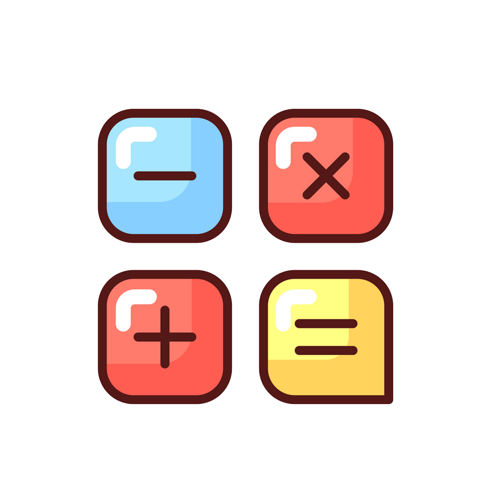
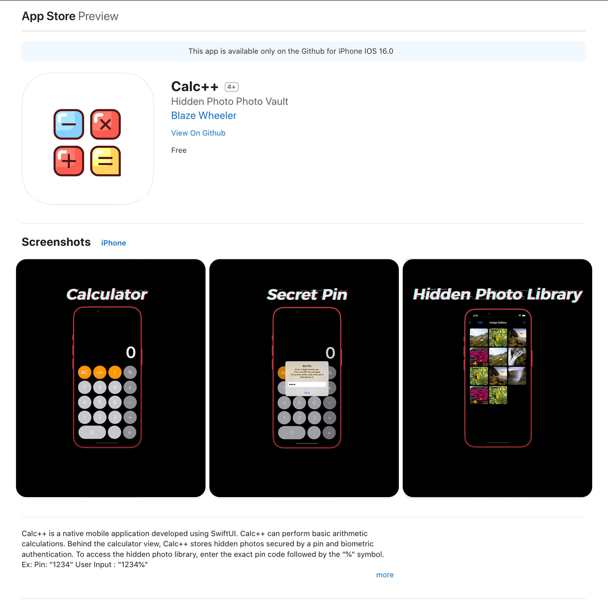

<!-- Improved compatibility of back to top link: See: https://github.com/othneildrew/Best-README-Template/pull/73 -->
<a name="readme-top"></a>


<!-- PROJECT SHIELDS -->
<!--
*** I'm using markdown "reference style" links for readability.
*** Reference links are enclosed in brackets [ ] instead of parentheses ( ).
*** See the bottom of this document for the declaration of the reference variables
*** for contributors-url, forks-url, etc. This is an optional, concise syntax you may use.
*** https://www.markdownguide.org/basic-syntax/#reference-style-links
-->
[![Apple-Silicon-Shield]][Apple-Silicon-Shield-url]
[![MIT License][license-shield]][license-url]
[![Apple License][Apple-License]][Apple-License-url]

[![LinkedIn][linkedin-shield]][linkedin-url]
[![GitHub][GitHub-shield]][GitHub-url]


<!-- PROJECT LOGO -->
<br />
<div align="center">
  <a href="https://github.com/BlazeWheeler/Swift_Projects/tree/main/Calc%2B%2B_PhotoVault%20">
    
  </a>

  <h3 align="center">Calc++</h3>

  <p align="center">
    A Photo Vault Application Built In Swift!
    <br />
    </div>


<!-- ABOUT THE PROJECT -->
## About The Project


Welcome to the Swift Steganography Calculator Calc++! This project combines the functionality of a standard calculator with the added feature of a hidden photo library, accessible only through the use of steganography techniques (a 5 digit pin). Built with Swift and SwiftUI, this application allows you to encrypt and decrypt images within the calculator interface, keeping your photos safe and secure. Whether you're looking to add an extra layer of security to your personal photos or just want to have some fun with steganography, this project is sure to be a unique and interesting addition to your portfolio. Below are instructions on how to build and run the code. Happy hiding!





<p align="right">(<a href="#readme-top">back to top</a>)</p>


### Built With

This Application is built natively with Swift & SwiftUI

* [![MacOs][MacOs]][MacOS-url]
* [![Swift][Swift]][Swift-url]

<p align="right">(<a href="#readme-top">back to top</a>)</p>


<!-- GETTING STARTED -->
## Getting Started / Installation

Getting started is fairly simple...

### Prerequisites


* Install Xcode 
* Download repository 
* Open
  ```sh
  Calc++.xcodeproj
  ```
* Build & Run


<!-- ROADMAP -->
## Roadmap

- [x] Create UI
- [x] Create Data Model
- [ ] Implement Horizontal UI
- [ ] Implement Splash Screen Pin Code Entry 
- [ ] Update Depreciated Code
 
## Further Documentation
 [](https://www.instagram.com/blazew/) 


<!-- LICENSE -->


# Released Under MIT License

Copyright (c) 2022 Blaze Wheeler,

Permission is hereby granted, free of charge, to any person
obtaining a copy of this software and associated documentation
files (the "Software"), to deal in the Software without
restriction, including without limitation the rights to use,
copy, modify, merge, publish, distribute, sublicense, and/or sell
copies of the Software, and to permit persons to whom the
Software is furnished to do so, subject to the following
conditions:

The above copyright notice and this permission notice shall be
included in all copies or substantial portions of the Software.

THE SOFTWARE IS PROVIDED "AS IS", WITHOUT WARRANTY OF ANY KIND,
EXPRESS OR IMPLIED, INCLUDING BUT NOT LIMITED TO THE WARRANTIES
OF MERCHANTABILITY, FITNESS FOR A PARTICULAR PURPOSE AND
NONINFRINGEMENT. IN NO EVENT SHALL THE AUTHORS OR COPYRIGHT
HOLDERS BE LIABLE FOR ANY CLAIM, DAMAGES OR OTHER LIABILITY,
WHETHER IN AN ACTION OF CONTRACT, TORT OR OTHERWISE, ARISING
FROM, OUT OF OR IN CONNECTION WITH THE SOFTWARE OR THE USE OR
OTHER DEALINGS IN THE SOFTWARE.
<p align="right">(<a href="#readme-top">back to top</a>)</p>


<!-- CONTACT -->
## Contact

Blaze Wheeler - [@blazew](https://www.instagram.com/blazew/) - wheelerb2@duq.edu


<p align="right">(<a href="#readme-top">back to top</a>)</p>


<!-- MARKDOWN LINKS & IMAGES -->
<!-- https://www.markdownguide.org/basic-syntax/#reference-style-links -->


[Apple-License]: https://img.shields.io/badge/LICENSE-ASPL-999999?style=for-the-badge&logo=apple&logoColor=white
[Apple-License-url]: https://opensource.apple.com/apsl/
[Apple-Silicon-Shield]: https://img.shields.io/badge/Apple-Silicon_M2-999999?style=for-the-badge&logo=apple&logoColor=white
[Apple-Silicon-Shield-url]: https://support.apple.com/en-us/HT211814

[license-shield]: https://img.shields.io/github/license/othneildrew/Best-README-Template.svg?style=for-the-badge
[license-url]: https://www.mit.edu/~amini/LICENSE.md
[linkedin-shield]: https://img.shields.io/badge/-LinkedIn-black.svg?style=for-the-badge&logo=linkedin&colorB=555

[linkedin-url]:https://www.linkedin.com/in/blaze-wheeler-8306a2223/
[GitHub-shield]: 	https://img.shields.io/badge/GitHub-100000?style=for-the-badge&logo=github&logoColor=white
[GitHub-url]: https://github.com/blazeWheeler
[product-screenshot]: images/screenshot.png
[MacOs]:https://img.shields.io/badge/mac%20os-000000?style=for-the-badge&logo=apple&logoColor=white
[MacOs-url]: https://www.apple.com/macos/ventura/

[MacOs-url]: https://www.apple.com/macos/ventura/
[Swift]: https://img.shields.io/badge/Swift-FA7343?style=for-the-badge&logo=swift&logoColor=white
[Swift-url]: https://www.apple.com/swift/


