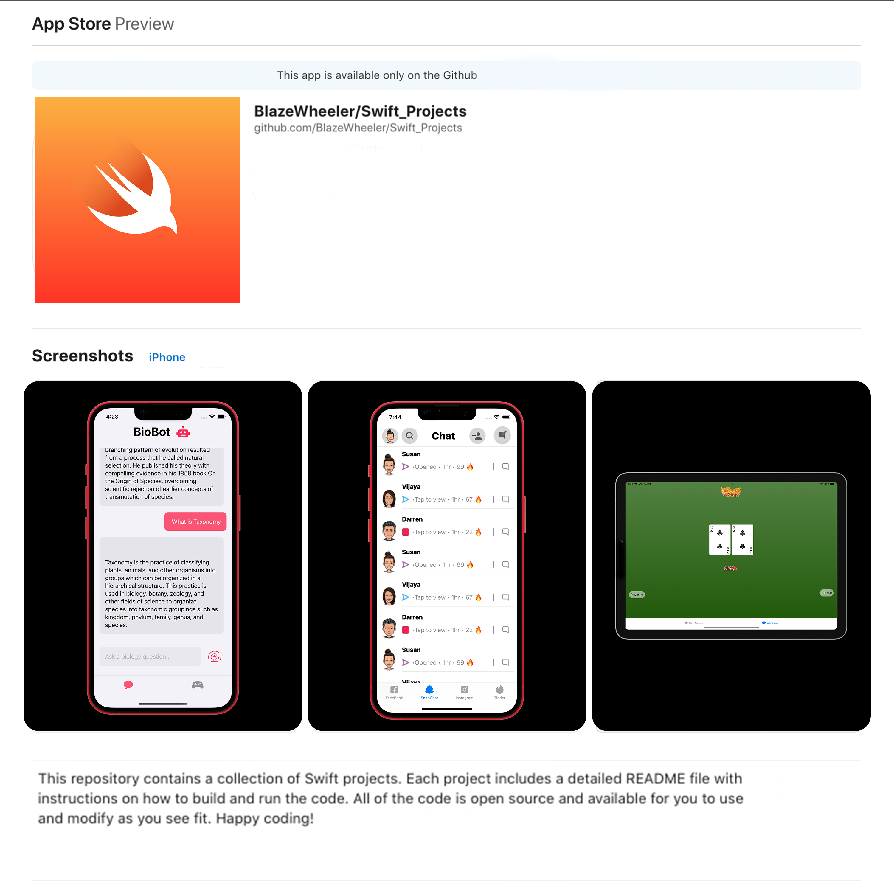

<!-- Improved compatibility of back to top link: See: https://github.com/othneildrew/Best-README-Template/pull/73 -->

<!-- PROJECT SHIELDS -->
<!--
*** I'm using markdown "reference style" links for readability.
*** Reference links are enclosed in brackets [ ] instead of parentheses ( ).
*** See the bottom of this document for the declaration of the reference variables
*** for contributors-url, forks-url, etc. This is an optional, concise syntax you may use.
*** https://www.markdownguide.org/basic-syntax/#reference-style-links
-->
[![Apple-Silicon-Shield]][Apple-Silicon-Shield-url]
[![MIT License][license-shield]][license-url]
[![Apple License][Apple-License]][Apple-License-url]

[![LinkedIn][linkedin-shield]][linkedin-url]
[![GitHub][GitHub-shield]][GitHub-url]

<!-- PROJECT LOGO -->
 

  

  <h3 align="center">BlazeWheeler/Swift_Projects</h3>

  

    Repository of Swift Projects
     
    

<!-- ABOUT THE PROJECT -->
## About The Repository
Welcome to My Swift Projects!

This repository contains a collection of Swift projects. Each project includes a detailed README file with instructions on how to build and run the code. All of the code is open source and available for you to use and modify as you see fit. Happy coding!

<!-- Change  -->

(<a href="#readme-top">back to top</a>)

### Technologies

Technologies used in this Repository

* [![MacOs][MacOs]][MacOS-url]
* [![Swift][Swift]][Swift-url]
* [![SwiftUI][SwiftUI-sheild]][SwiftUI-url]
* [![OpenAI][OpenAI-sheild]][OpenAI-url]
* [![Xcode-sheild][Xcode-sheild]][Xcode-url]

(<a href="#readme-top">back to top</a>)

<!-- LICENSE -->

# Released Under MIT License

Copyright (c) 2022 Blaze Wheeler,

Permission is hereby granted, free of charge, to any person
obtaining a copy of this software and associated documentation
files (the "Software"), to deal in the Software without
restriction, including without limitation the rights to use,
copy, modify, merge, publish, distribute, sublicense, and/or sell
copies of the Software, and to permit persons to whom the
Software is furnished to do so, subject to the following
conditions:

The above copyright notice and this permission notice shall be
included in all copies or substantial portions of the Software.

THE SOFTWARE IS PROVIDED "AS IS", WITHOUT WARRANTY OF ANY KIND,
EXPRESS OR IMPLIED, INCLUDING BUT NOT LIMITED TO THE WARRANTIES
OF MERCHANTABILITY, FITNESS FOR A PARTICULAR PURPOSE AND
NONINFRINGEMENT. IN NO EVENT SHALL THE AUTHORS OR COPYRIGHT
HOLDERS BE LIABLE FOR ANY CLAIM, DAMAGES OR OTHER LIABILITY,
WHETHER IN AN ACTION OF CONTRACT, TORT OR OTHERWISE, ARISING
FROM, OUT OF OR IN CONNECTION WITH THE SOFTWARE OR THE USE OR
OTHER DEALINGS IN THE SOFTWARE.

(<a href="#readme-top">back to top</a>)

# Released Under ASPL License

Copyright (c) 2022 Blaze Wheeler, 1999-2007 Apple Inc.  
All Rights Reserved.

Subject to the licenses granted under this License, each Contributor retains all rights, title and interest in and to any Modifications made by such Contributor.  Apple retains all rights, title and interest in and to the Original Code and any Modifications made by or on behalf of Apple ("Apple Modifications"), and such Apple Modifications will not be automatically subject to this License.  Apple may, at its sole discretion, choose to license such Apple Modifications under this License, or on different terms from those contained in this License or may choose not to license them at all.  

The above copyright notice and this permission notice shall be
included in all copies or substantial portions of the Software.

The Original Code and all software distributed under the License are distributed on an 'AS IS' basis, WITHOUT WARRANTY OF ANY KIND, EITHER EXPRESS OR IMPLIED, AND APPLE HEREBY DISCLAIMS ALL SUCH WARRANTIES, INCLUDING WITHOUT LIMITATION, ANY WARRANTIES OF MERCHANTABILITY, FITNESS FOR A PARTICULAR PURPOSE, QUIET ENJOYMENT OR NON-INFRINGEMENT.  Please see the License for the specific language governing rights and limitations under the License." 
 <a href="http://www.opensource.apple.com/apsl/"> Apple ASPL License</a>

(<a href="#readme-top">back to top</a>)

<!-- CONTACT -->
## Contact

Blaze Wheeler - [@blazew](https://www.instagram.com/blazew/) - wheelerb2@duq.edu

(<a href="#readme-top">back to top</a>)

<!-- MARKDOWN LINKS & IMAGES -->
<!-- https://www.markdownguide.org/basic-syntax/#reference-style-links -->

[Apple-License]: https://img.shields.io/badge/LICENSE-ASPL-999999?style=for-the-badge&logo=apple&logoColor=white
[Apple-License-url]: https://opensource.apple.com/apsl/
[Apple-Silicon-Shield]: https://img.shields.io/badge/Apple-Silicon_M2-999999?style=for-the-badge&logo=apple&logoColor=white
[Apple-Silicon-Shield-url]: https://support.apple.com/en-us/HT211814

[license-shield]: https://img.shields.io/github/license/othneildrew/Best-README-Template.svg?style=for-the-badge
[license-url]: https://www.mit.edu/~amini/LICENSE.md
[linkedin-shield]: https://img.shields.io/badge/-LinkedIn-black.svg?style=for-the-badge&logo=linkedin&colorB=555

[linkedin-url]:https://www.linkedin.com/in/blaze-wheeler-8306a2223/
[GitHub-shield]: 	https://img.shields.io/badge/GitHub-100000?style=for-the-badge&logo=github&logoColor=white
[GitHub-url]: https://github.com/blazeWheeler

[MacOs]:https://img.shields.io/badge/mac%20os-000000?style=for-the-badge&logo=apple&logoColor=white
[MacOs-url]: https://www.apple.com/macos/ventura/
[MacOs-url]: https://www.apple.com/macos/ventura/

[Swift]: https://img.shields.io/badge/Swift-FA7343?style=for-the-badge&logo=swift&logoColor=white
[Swift-url]: https://www.apple.com/swift/

[SwiftUI-sheild]: https://img.shields.io/badge/SwiftUI-FA7343?style=for-the-badge&logo=swift&logoColor=white 
[SwiftUI-url]: https://developer.apple.com/xcode/swiftui/

[Instagram]:https://img.shields.io/badge/Instagram-E4405F?style=for-the-badge&logo=instagram&logoColor=white
[Instagram-url]: https://www.instagram.com/

[OpenAI-sheild]: https://img.shields.io/badge/OpenAI-412991.svg?style=for-the-badge&logo=OpenAI&logoColor=white 
[OpenAI-url]: https://openai.com/

[Xcode-sheild]: https://img.shields.io/badge/Xcode-147EFB.svg?style=for-the-badge&logo=Xcode&logoColor=white 
[Xcode-url]: https://developer.apple.com/xcode/

